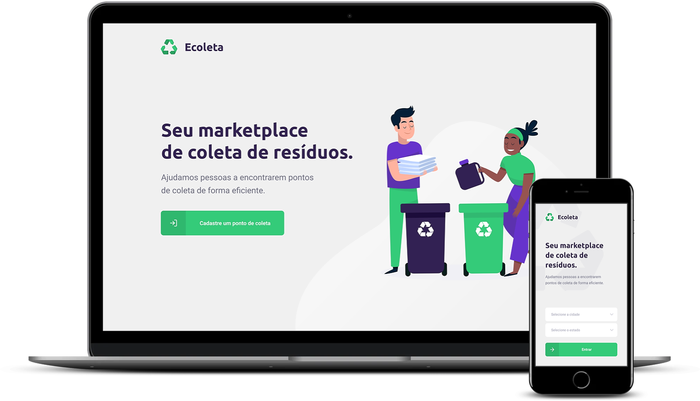

<h1 align="center">
    
</h1>

 :rocket: <b>Next Level Week #01</b>  por <a href="https://rocketseat.com.br/">Rocketseat</a>

## Tecnologias

Projeto desenvolvido com as seguintes tecnologias:

- [Node.js](https://nodejs.org/en/)
- [ReactJS](https://pt-br.reactjs.org/)
- [React Native](https://reactnative.dev/)
- [Expo](https://expo.io/)

## Projeto

O aplicativo funciona como um marketplace de pontos de coleta de resíduos e qualquer pessoa pode usar. Empresas podem se cadastrar pela página web e usuários utilizam o app para encontrar pontos de coleta próximos da sua localização.
